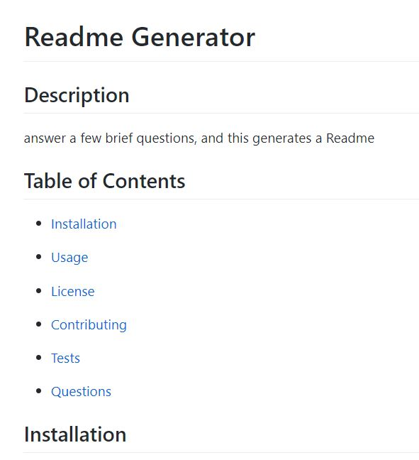

# readme-generator

  ## Description
  Writes a brief readme for your application
  

  ## Table of Contents
  * [Installation](#installation)

  * [Usage](#usage)
  
  * [License](#license)
  
  * [Contributing](#contributing)
  
  * [Tests](#tests)
  
  * [Questions](#questions)

  ## Installation
  To install: 
  install node.js, and download readme-generator files.

  ## Usage 

  run "node index.js" in teh terminal, and answer the questions to generate a Readme.

  ## License

  Eclipse Public License 2.0

  ## Contributing 

  Feel free to contribute

  ## Questions

  If you have any questions, run into any issues, or just want to chat with me, Carl , you can reach me at koepkecj@gmail.com.  Check out more of my work here: [Carl-33](https://github.com/Carl-33/).

  